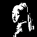
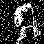

# Rete neurale di Hopfield

Una **rete neurale di Hopfield** è un tipo di rete neurale ricorrente introdotta da John J. Hopfield nel 1982. Queste reti sono progettate per funzionare come sistemi di memoria associativa: sono capaci di "ricordare" pattern immagazzinati e di correggere input distorti o incompleti, convergendo verso lo stato memorizzato più simile. Le reti di Hopfield sono composte da neuroni completamente connessi tra loro, con pesi simmetrici e senza auto-connessioni. Ogni neurone aggiorna il proprio stato in base agli stati degli altri neuroni, seguendo una dinamica che porta il sistema a minimizzare una _funzione di energia_, fino a raggiungere una convergenza. Il lavoro originale di John J. Hopfield:  [Hopfield, "Neural networks and physical systems with emergent collective computational abilities" (1982)](https://www.pnas.org/doi/10.1073/pnas.79.8.2554)

## Outline

- [Rete neurale di Hopfield](#rete-neurale-di-hopfield)
  - [Outline](#outline)
  - [Descrizione generale](#descrizione-generale)
  - [1. Acquisizione dei pattern](#1-acquisizione-dei-pattern)
  - [2. Fase di apprendimento](#2-fase-di-apprendimento)
  - [3. Fase di richiamo](#3-fase-di-richiamo)
  - [Esempio semplificato](#esempio-semplificato)
    - [Passo 1: Inizializzazione](#passo-1-inizializzazione)
    - [Passo 2: Matrice dei pesi con la regola di Hebb](#passo-2-matrice-dei-pesi-con-la-regola-di-hebb)
    - [Passo 3: Richiamo di un pattern rumoroso](#passo-3-richiamo-di-un-pattern-rumoroso)
  - [Limitazioni del modello](#limitazioni-del-modello)
  - [Possibili estensioni del modello](#possibili-estensioni-del-modello)
  - [Link utili](#link-utili)

## Descrizione generale

L'obiettivo generale del progetto è sviluppare una rete neurale di Hopfield capace di memorizzare, richiamare e correggere pattern binari.  
Le attività descritte possono essere suddivise anche in tre programmi distinti, ognuno dedicato a una singola fase del processo.

1. **Acquisizione dei pattern**  
Leggere immagini o pattern di input, convertirli in formato binario (valori -1 o +1) e prepararli per l'elaborazione da parte della rete. Se i pattern hanno dimensioni diverse, essi devono essere ridimensionati per uniformare le loro dimensioni, garantendo che tutti i pattern abbiano la stessa risoluzione prima della conversione in binario.

2. **Fase di training**  
Addestrare la rete memorizzando i pattern binari in una matrice dei pesi, secondo la regola di apprendimento di Hebb, e salvare questa matrice su file per un uso successivo.

3. **Fase di recall e analisi della convergenza**  
A partire da un pattern noto:

- Introdurre rumore, invertendo casualmente alcuni pixel, oppure corrompere il pattern invertendo un'intera porzione dell'immagine;

- Caricare la matrice dei pesi precedentemente salvata e tentare di ricostruire il pattern corretto, facendo convergere il sistema verso uno dei pattern memorizzati;

- Monitorare l'andamento del processo calcolando una _funzione di energia_ ad ogni iterazione, verificando che essa diminuisca progressivamente fino a raggiungere un minimo, indicando la stabilizzazione della rete.

## 1. Acquisizione dei pattern

La fase di Input/Output ha l'obiettivo di preparare i pattern binari da utilizzare per l'addestramento e il richiamo della rete neurale.

- **Caricamento dei pattern**  
Ogni immagine di input (ad esempio file PNG a colori) viene caricata accedendo direttamente ai pixel, ad esempio tramite una libreria grafica come SFML. 
- **Uniformazione delle dimensioni**  
Affinché la rete possa trattare correttamente i diversi pattern, **tutti** devono avere la stessa dimensione $N$ (intesa come numero di pixel). Se le immagini iniziali hanno dimensioni diverse, è necessario ridimensionarle.  
Alcuni approcci possibili sono:
  - **Metodo semplice**: rimozione regolare di righe e colonne di pixel, ad esempio eliminando ogni $k$-esima riga/colonna per adattare la dimensione.
  - **Metodo più accurato**: ridimensionamento tramite **interpolazione bilineare**, che calcola i valori dei pixel nuovi combinando in modo pesato i pixel adiacenti, garantendo una migliore qualità visiva del pattern ridimensionato.
- **Costruzione del pattern binario**
Per ogni pixel, il valore binario viene determinato mediando le componenti $R$, $G$, $B$ (tutte comprese tra 0 e 255) del colore. Se il valore medio supera una soglia prefissata (e.g. 127), il pixel viene considerato acceso ($+1$), altrimenti spento ($-1$). L'immagine binarizzata viene poi "srotolata" in un vettore monodimensionale di lunghezza $N$, ottenuto leggendo i pixel riga per riga.  
Il pattern associato a ciascuna immagine viene indicato come $x_i^\mu$, dove:
  - $i$ varia da $1$ a $N$ ed è l'indice dei neuroni (pixel),
  - $\mu$ varia da $1$ al numero totale di pattern memorizzati.
- **Visualizzazione dei pattern**  
È utile fornire strumenti per visualizzare sia il pattern originale che quello binarizzato e srotolato, per controllare visivamente la correttezza del processo di conversione come possiamo vedere nella figura.

<div style="text-align: center;">  </div>

## 2. Fase di apprendimento

La fase di apprendimento consiste nel costruire la memoria della rete neurale tramite il calcolo della matrice dei pesi $W$.

- **Calcolo della matrice dei pesi $W$**
  La matrice viene calcolata applicando la **regola di Hebb**, che associa a ogni coppia di neuroni un valore proporzionale alla correlazione tra i loro stati nei diversi pattern memorizzati. La formula esplicita è:

```math
W_{ij} = 
\begin{cases}
\frac{1}{N} \sum\limits_{\mu=1}^{P} x_i^\mu x_j^\mu & \quad \text{se } i \neq j\\
0 & \quad \text{se } i = j
\end{cases}
```

  dove $x_i^\mu$ rappresenta il valore del neurone $i$ nel pattern $\mu$, $N$ è il numero totale di neuroni (dimensione del pattern srotolato), $P$ è il numero totale di pattern che si vogliono memorizzare.

- **Proprietà della matrice $W$**  
  La matrice $W$ è **simmetrica**, ovvero:

```math
W_{ij} = W_{ji} \quad \forall i,j
```

- **Salvataggio della matrice dei pesi**  
  Dopo aver completato il calcolo, è possibile **salvare la matrice dei pesi $W$** su un file.  
  Questo permette di evitare di ripetere la fase di apprendimento ogni volta, ricaricando direttamente la rete già addestrata per la fase di richiamo.

## 3. Fase di richiamo

A questo punto, la rete neurale è stata addestrata e possiede una memoria costruita sulla base dei pattern di training. La fase di richiamo consiste nel presentare alla rete un **pattern corrotto** o **tagliato** e verificare se la rete è in grado di riconoscerlo e correggerlo, associandolo a uno dei pattern che ha memorizzato.

- **Preparazione del pattern corrotto**  
  Si possono implementare funzioni che, dato un pattern di input, lo **corrompono** (invertendo casualmente alcuni pixel) oppure lo **tagliano** (modificando sistematicamente una parte del pattern), simulando situazioni in cui l'informazione è parziale o rumorosa.
  <div style="text-align: center;"></div>
  
- **Dinamica di aggiornamento**  
  La rete aggiorna lo stato di ciascun neurone seguendo la regola di Hopfield:

```math
x_i(t+1) = \text{sign}\left(\sum_j W_{ij} x_j(t) \right)
```

  dove $t$ rappresenta l'indice temporale delle iterazioni, $x_i(t)$ è lo stato (valore binario $-1$ o $+1$) del neurone $i$ al tempo $t$, il valore di $x_i(t+1)$ dipende dalla funzione segno (che restituisce -1 se l'argiomento è negativo, +1 altrimenti) della somma pesata degli stati degli altri neuroni al tempo $t$.

- **Criterio di convergenza**  
  Il processo di aggiornamento viene **ripetuto iterativamente** finché il pattern **non converge**, ovvero finché:

```math
x_i(t+1) = x_i(t) \quad \forall i
```

  In altre parole, l'aggiornamento non cambia più lo stato della rete da un'iterazione all'altra.

- **Monitoraggio dell'evoluzione**  
  Durante il processo di richiamo, è utile visualizzare:
  - Il pattern corrotto iniziale,
  - L'evoluzione del pattern a ogni iterazione (ad esempio frame per frame),
  - Il pattern finale raggiunto dopo la convergenza.

- **Introduzione della funzione energia**  
  Per analizzare l'andamento della rete durante il richiamo, si può introdurre una **funzione energia** definita come:

```math
E(t) = -\frac{1}{2} \sum_{i,j} W_{ij} x_i(t) x_j(t)
```

  Questa "energia" non corrisponde a un'energia fisica reale, ma è un'analogia: rappresenta una misura della "stabilità" della rete. Durante il richiamo, la funzione energia **decresce** o **rimane costante** a ogni iterazione, e il processo di richiamo si conclude quando l'energia raggiunge un minimo locale. Monitorare $E(t)$ permette di verificare se e come la rete sta convergendo verso uno stato stabile.

## Esempio semplificato

Abbiamo due pattern binari che vogliamo memorizzare nella rete:

```math
x^{(1)} = (-1,1,1, -1)\\ 
x^{(2)} = (1, -1, -1, 1)
```

### Passo 1: Inizializzazione

Costruiamo una matrice dei pesi $W$ di dimensione $4 \times 4$ (poiché abbiamo 4 neuroni).  
Impostiamo **tutti gli elementi sulla diagonale a zero** per evitare auto-connessioni, cioè:

```math
W_{ij} = 0 \quad \text{per} \quad i = j
```

### Passo 2: Matrice dei pesi con la regola di Hebb
Utilizziamo la **regola di Hebb** per aggiornare i pesi considerando tutti i pattern:

```math
W_{ij} = \frac{1}{N} \sum_{\mu=1}^{P} x_i^\mu x_j^\mu
```

dove:
- $N$ è il numero di neuroni (4),
- $P$ è il numero di pattern memorizzati (2).

Calcoliamo $w_{ij}$ per ciascuna coppia $(i,j)$:

| Coppia | Calcolo Pattern 1 | Calcolo Pattern 2 | $W_{ij}$ |
|--------|-------------------|-------------------|----------|
| $W_{12}$ | $x_1^{(1)} \cdot x_2^{(1)} = -1$ | $x_1^{(2)} \cdot x_2^{(2)} = -1$ | $-1/2$ |
| $W_{13}$ | $x_1^{(1)} \cdot x_3^{(1)} = -1$ | $x_1^{(2)} \cdot x_3^{(2)} = -1$ | $-1/2$ |
| $W_{14}$ | $x_1^{(1)} \cdot x_4^{(1)} = 1$  | $x_1^{(2)} \cdot x_4^{(2)} = 1$ | $1/2$ |
| $W_{23}$ | $x_2^{(1)} \cdot x_3^{(1)} = 1$  | $x_2^{(2)} \cdot x_3^{(2)} = 1$ | $1/2$ |
| $W_{24}$ | $x_2^{(1)} \cdot x_4^{(1)} = -1$ | $x_2^{(2)} \cdot x_4^{(2)} = -1$ | $-1/2$ |
| $W_{34}$ | $x_3^{(1)} \cdot x_4^{(1)} = -1$ | $x_3^{(2)} \cdot x_4^{(2)} = -1$ | $-1/2$ |

**Nota**: Poiché i pesi sono simmetrici ($W_{ij} = W_{ji}$), basta calcolarli una sola volta.

### Passo 3: Richiamo di un pattern rumoroso

Supponiamo di iniziare con un pattern parzialmente corrotto:

```math
x_{\text{iniziale}} = (1, -1, 1, -1)
```

(dove il primo bit è errato rispetto a $x^{(1)}$).

Ora aggiorniamo ogni neurone calcolando il suo **campo locale** e applicando la **funzione segno**:

```math
x_1' = \text{sgn}((-1/2) \cdot 1 + (-1/2) \cdot (-1) + 1/2 \cdot (-1)) = \text{sgn}(-1/2)
```

Risultato: $x_1' = -1$.

```math
x_2' = \text{sgn}((-1/2) \cdot (-1) + 1/2 \cdot (-1) + (-1/2) \cdot (-1)) = \text{sgn}(1/2)
```

Risultato: $x_2' = 1$.

```math
x_3' = \text{sgn}((-1/2) \cdot (-1) + 1/2 \cdot 1 + (-1/2) \cdot (-1)) = \text{sgn}(3/2)
```

Risultato: $x_3' = 1$.

```math
x_4' = \text{sgn}(1/2 \cdot (-1) + (-1/2) \cdot 1 + (-1/2) \cdot (-1)) = \text{sgn}(-1/2)
```

Risultato: $x_4' = -1$.

Quindi, il pattern aggiornato è:

```math
x' = (-1, 1, 1, -1)
```

La rete ha corretto il bit sbagliato, recuperando il pattern memorizzato più vicino!

## Limitazioni del modello

- Il numero massimo di pattern memorizzabili senza errori è limitato a circa $0.138 \times N$, con $N$ numero di neuroni.
- Possono emergere **stati spuri**, ossia configurazioni stabili non corrispondenti ai pattern memorizzati.
- La rete gestisce solo pattern binari con valori $-1$ e $+1$.
- Pattern molto simili tra loro possono confondere la rete durante il richiamo.
- La convergenza può portare a minimi locali non desiderati invece del pattern corretto.

## Possibili estensioni del modello

- **[Algoritmo di Metropolis-Hastings](https://en.wikipedia.org/wiki/Metropolis%E2%80%93Hastings_algorithm)**  
  Introdurre una dinamica stocastica in cui i flip degli stati dei neuroni avvengono con una certa probabilità, basata sulla variazione di energia.  
  Questo può aiutare a superare minimi locali spuri, permettendo alla rete di esplorare meglio lo spazio degli stati e trovare il pattern corretto.

- **[Aggiunta di rumore termico (Simulated Annealing)](https://en.wikipedia.org/wiki/Simulated_annealing)**  
  Integrare una "temperatura" che decresce gradualmente per favorire l'esplorazione iniziale e la convergenza finale verso stati di energia minima globale.

## Link utili

- **[Hopfield Networks is All You Need](https://ml-jku.github.io/hopfield-layers/)**  
  Una panoramica moderna sulle reti di Hopfield, con estensioni deep learning e connessioni con architetture moderne.
