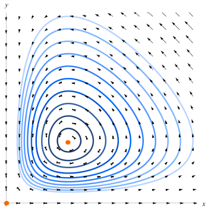

<!-- omit in toc -->
# Simulazione dell'interazione tra due specie

- [Descrizione del problema](#descrizione-del-problema)
- [Le equazioni di Lotka-Volterra](#le-equazioni-di-lotka-volterra)
  - [Note sulla dinamica del sistema](#note-sulla-dinamica-del-sistema)
  - [Versione discretizzata delle equazioni](#versione-discretizzata-delle-equazioni)
- [Implementazione della simulazione in C++](#implementazione-della-simulazione-in-c)
- [Variazioni sul tema](#variazioni-sul-tema)
- [Riferimenti utili](#riferimenti-utili)

## Descrizione del problema

Il compito consiste nella progettazione e nell'implementazione di una
simulazione che descriva, in uno scenario opportunamente semplificato,
l'interazione tra due specie che coesistono in un **ecosistema**.

La prima delle due specie considerate è quella delle **prede**, le quali (in
analogia con gli animali erbivori che abitano un'area fertile)
hanno a disposizione una quantità illimitata di cibo.
La seconda specie, cioè i **predatori**, utilizza le prede come fonte di
sostentamento.

Nel modello considerato, il successo nella caccia avviene con una probabilità
proporzionale al prodotto tra il numero di **prede** e il numero di
**predatori**.

Il sistema di equazioni utilizzato per la simulazione è quello proposto, in
maniera indipendente, da Lotka nel 1925 e da Volterra nel 1926.

## Le equazioni di Lotka-Volterra

Dette rispettivamente $x(t)$ e $y(t)$ le densità di **prede** e di **predatori**
ad un dato istante $t$ (calcolate rispetto all'area in cui le due specie
coesistono), il sistema dinamico può essere descritto dalla seguente coppia di
equazioni differenziali:

$$
\begin{align*}
\frac{dx}{dt} &= (A - B y(t)) x(t)\\
\frac{dy}{dt} &= (C x(t) - D ) y(t)\\
\end{align*}
$$

Dove i parametri $A$ e $C$ indicano quanto rapidamente le due specie possano
riprodursi, una volta trovato cibo sufficiente, mentre i parametri $B$ e $D$
descrivono il tasso di mortalità delle due specie. La mortalità delle **prede**
è dovuta al cadere vittime dei **predatori**, mentre la mortalità dei
**predatori** è dettata dalla loro morte per stenti in caso la quantità di prede
catturate sia insufficiente al sostentamento.

Tutti e quattro i parametri sono da intendersi come **numeri reali strettamente
maggiori di 0**.

> [!NOTE]
> Come descritto sopra, il tasso di nutrimento e riproduzione dei predatori
> dipende, a meno di una costante, dal prodotto $x(t) \cdot y(t)$, così come il
> tasso di mortalità delle prede.

### Note sulla dinamica del sistema

Dato uno stato iniziale con $x(0)$ e $y(0)$ entrambi reali e maggiori di 0,
le orbite del sistema sono ristrette a coppie di valori $(x(t), y(t))$ positivi,
come mostrato in figura.

Inoltre, la soluzione del sistema di equazioni differenziali presenta due punti
di equilibrio:

$$\begin{align*}
e_{1} &= (0, 0)\\
e_{2} &= \left(\frac{D}{C}, \frac{A}{B} \right)\\
\end{align*}$$

Analogamente al caso dell'energia totale di punti materiali sottoposti
all'azione di soli campi di forze conservativi, il sistema è caratterizzato da
un **integrale primo** che **rimane costante nel tempo**:

$$\begin{align*}
H(x,y) &= -D\ln(x)+Cx+By-A\ln(y)
\end{align*}$$

### Versione discretizzata delle equazioni

Discretizzando le equazioni di Lotka-Volterra si ottiene:

$$\begin{align*}
x_i &= x_{i-1} + (A - B  y_{i-1}) x_{i-1} \Delta t\\
y_i &= y_{i-1} + (C x_{i-1} - D ) y_{i-1} \Delta t\\
\end{align*}$$

inoltre, esprimendo le variabili $(x_i, y_i)$ come frazione dei valori del punto
di equilibrio $e_{2}$:

$$\begin{align*}
x_i^{rel} &= x_{i} \frac{C}{D} \\
y_i^{rel} &= y_{i} \frac{B}{A} \\
\end{align*}$$

le equazioni discretizzate diventano $${\color{green}^{\textbf{[1]}}}$$:

$$\begin{align*}
x_i^{rel} &= x_{i-1}^{rel} + A (1 - y_{i-1}^{rel}) x_{i-1}^{rel} \Delta t\\
y_i^{rel} &= y_{i-1}^{rel} + D (x_{i-1}^{rel} - 1) y_{i-1}^{rel} \Delta t\\
\end{align*}$$

## Implementazione della simulazione in C++

Viene richiesto di sviluppare una simulazione che, introdotto uno stato
iniziale $(x_0, y_0)$ ed una serie di parametri $A, B, C, D$ **validi**,
utilizzi la versione discretizzata delle equazioni di Lotka-Volterra 
presentata in $${\color{green}^{\textbf{[1]}}}$$ per calcolare, ad ogni passo
dell'evoluzione, i valori $(x_i, y_i, H_i)$.

La durata totale della simulazione, espressa in multipli interi dell'unità
di tempo $\Delta t$, deve essere una variabile che l'utente può introdurre a
_runtime_.

Oltre alle caratteristiche minime che ogni progetto deve soddisfare (menzionate
nella [pagina principale della repository](README.md)), in questo caso sono
posti alcuni vincoli ulteriori.

**In primis**, la descrizione del sistema deve essere implementata tramite una
classe `Simulation` la quale deve, quantomeno:
- contenere un metodo `evolve()` che permetta di fare progredire la
  simulazione di una singola unità $\Delta t$;
- mantenere al suo interno i **valori assoluti** $(x_i, y_i, H_i)$ per **tutti
  gli stati di evoluzione del sistema** e renderli accessibili all'utente per
  eventuali stampe su schermo o analisi.

**In secondo luogo**, al fine di migliorare la stabilità del calcolo numerico,
si richiede di:
- utilizzare valori di $\Delta t$ dell'ordine di $0.001$;
- rappresentare **internamente** lo stato del sistema ad un dato istante $t$ in
  termini di $(x_i^{rel}, y_i^{rel})$;
- implementare il metodo `evolve()` utilizzando la formula descritta in
  $${\color{green}^{\textbf{[1]}}}$$, che fa uso dei valori relativi
  $(x_i^{rel}, y_i^{rel})$ .

> [!NOTE]
> Ad esempio, in un sistema in cui $e_{2} = (1000.0, 800.0)$ la coppia di
> valori $(x_i, y_i) = (1200.0, 1000.0)$, deve essere rappresentata nella classe
> `Simulation` come $(x_i^{rel}, y_i^{rel}) = (1.2, 1.25)$.

Ogni metodo che **espone gli stati del sistema** per le analisi successive deve
restituire $x_i$ e $y_i$ espressi come **valori assoluti**.

## Variazioni sul tema

La soluzione minimale del progetto richiede che i dati da salvare possano
essere stampati a schermo o registrati in un file di output.

In aggiunta, è possibile considerare una o più delle seguenti variazioni
**opzionali**:

- si possono implementare gli strumenti per visualizzare in maniera grafica
  l'andamento del numero di **prede**, **predatori** e dell'integrale primo $H$,
  in funzione del tempo;
- si può sviluppare una finestra che disegni in un piano cartesiano l'_orbita_
  del numero di **prede** $x_i$ e **predatori** $y_i$;
- si può sviluppare una simulazione del modello in una griglia discreta, dove
  prede e predatori occupano delle celle e possono interagire coi loro "vicini";
- la simulazione del modello può anche avvenire in uno spazio continuo, in cui
  prede e predatori sono liberi di muoversi;
- ogni altra variazione che vi paia interessante.

## Riferimenti utili

- [Equazioni di Lotka-Volterra - wikipedia](https://it.wikipedia.org/wiki/Equazioni_di_Lotka-Volterra)
- [Game of Life - wikipedia](https://it.wikipedia.org/wiki/Gioco_della_vita)
